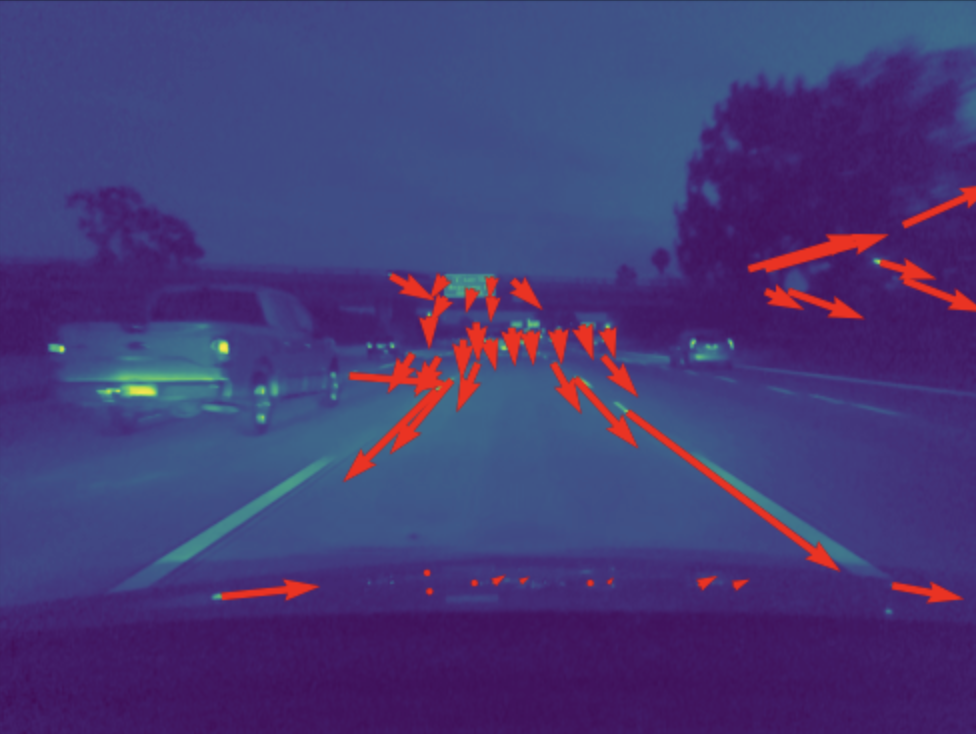

## Monocular SLAM for online calibration

  

Some code to tacke the challenge in the [comma.ai calibration challenge](https://github.com/commaai/calib_challenge). Input videos 

### Approach

* Use a semantic segmentation network to mask regions within frames that contain dynamic objects (other vehicles, motorbike, etc.)
* Find correspondences from consecutive frames on non-masked regions
* Estimate rigid body transformation between frames
* Extract pitch/yaw angle from rigid body transformation

This also applies some temporal smoothing to account for noisy correspondences.
